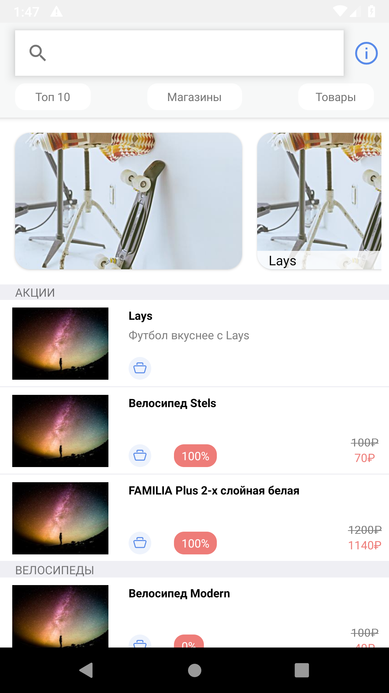
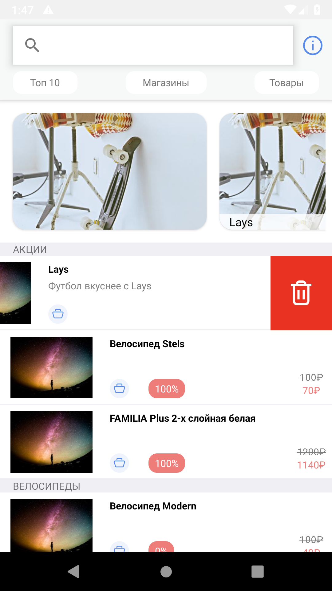

# CheeseApp

1) Сверстать экран мобильного приложения и реализовать корректную
логику работы всех его элементов:

• Кнопка должна модально открывать пустой экран с возможностью закрыть его.

• Фильтр «Топ 10, Магазины и Товары» должен переключаться, но никак не влиять на отображение остальных данных.

• Горизонтальный слайдер должен работать в режиме пагинации, все баннеры в слайдере (за исключением первого и последнего) должны центрироваться. Слайдер должен скроллиться вместе состальным контентом.

• По свайпу влево у ячеек должна появляться кнопка удаления, никакого действия по нажатию на нее производиться не должно.

2) Реализовать загрузку отображаемых данных с сервера

    
